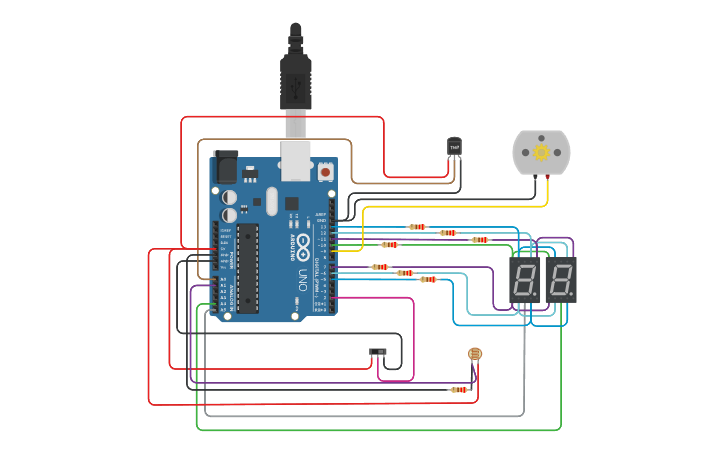

## Integrantes 
- Leon Gabriel Martinez Aquino - 1B

## Proyecto: Parte 3 Parcial Domiciliario SPD.

## Descripción
Utilizando la fotoresitencia se regula la intensidad de la luz de 3 led de ambos display 7 segmentos (leds: "G-B-C").

## Función principal
Se alteraron las 9 funciones encargadas de representar los numeros, ahora los leds (CERO - TRES - SEIS) responden a la "luminosidadRelativa" calculada de la siguiente manera (valor del sensor de fotoresistencia - 55). 

Este calculo esta dado para restringir el valor a 255 (maximo voltaje entregado por arduino) por que el maximo valor devuelto por la fotoresistencia es 310.

~~~ C (lenguaje en el que esta escrito)
void EncenderNueve(int tiempo)
{	
    ApagarTodo();
  EncenderLed(UNO, 0);
  EncenderLed(DOS, 0); 
  analogWrite(CERO,luminosidadRelativa);  
  analogWrite(TRES,luminosidadRelativa);  
  analogWrite(SEIS,luminosidadRelativa);
    delay(tiempo);
}
~~~

## :robot: Link al proyecto
- [proyecto](https://www.tinkercad.com/things/fC6OOCeKKh7-p3-parcial-domiciliario-1b-leon-gabriel-martinez-aquino/editel?sharecode=neuAH2-A4Fx9yWR6lQGP5GO6jLijJCL_4fioSLb_iCI)

---
### Fuentes
- Distintos sitios web.
---
## Fotoresistencia:
Definicion: El LDR (Light Dependent Resistor) o fotorresistencia es un componente eléctrico que varía su resistencia en función de la luz que llega a la superficie del dispositivo.

En tinkercad la fotoresistencia se utiliza conectandola a 3 pines (pin analogico, 5 volts y gnd) y esta hace uso de los 5 volts devolviendo un voltaje especifico al pin analogico, este voltaje se traduce en un rango de (1 a 310) que indica el valor medido por la fotoresistencia.

