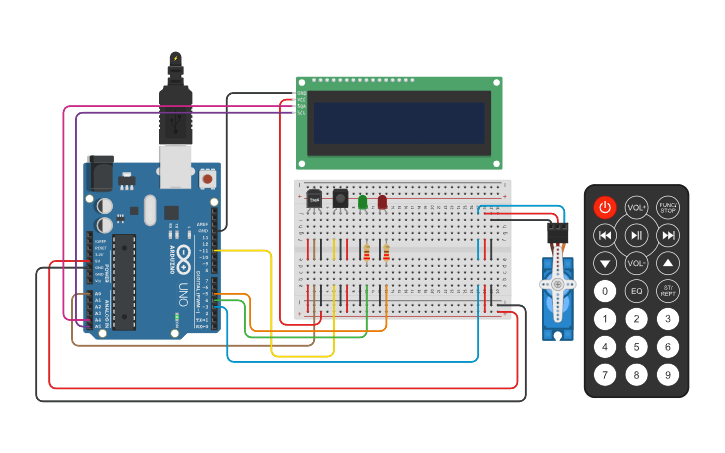

## Integrantes 
- Leon Gabriel Martinez Aquino - 1B

## Proyecto: Segundo Parcial Domiciliario SPD.

## Componenetes:

Arduino UNO.

Sensor de temperatura.

Control remoto IR (Infrarrojo).

Display LCD (16x2 caracteres).

Servo motor.

Cables y resistencias según sea necesario.

Protoboard para realizar las conexiones.

Dos leds.

## Descripción Sistema de incendio con Arduino.
El sistema se enciende y apaga con control remoto, si el sistema esta encendido se muestra en el Display LCD la temperatura y temporada actual. 

Si la temperatura fuera mayor a 59°C se mostraria un mensaje de incendio y la temperatura en el Display LCD , ademas se activaria un servo y la titilaria la led roja.

El led rojo titila si hay un incendio, por defecto esta apagado.

El led verde se apaga si hay un incendio, esta prendido si el sistema esta funcionando.

## :robot: Link al proyecto
- [proyecto TKC](https://www.tinkercad.com/things/kLCt6G5Fe29-parcial-domiciliario-2-1b-leon-gabriel-martinez-aquino/editel?sharecode=5TzxzrP_L5w_Xiq5je0ZOPdIxM8QHviStjDdwteeIbE)
  
- [proyecto GDB](https://onlinegdb.com/CmoRNGELD)

